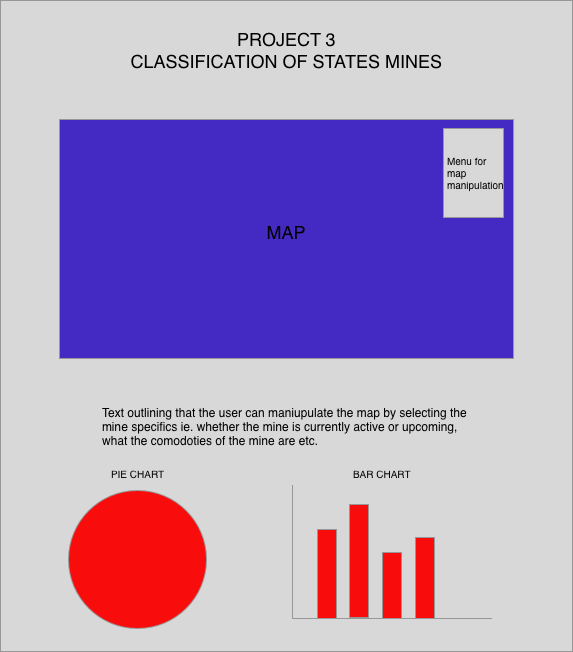
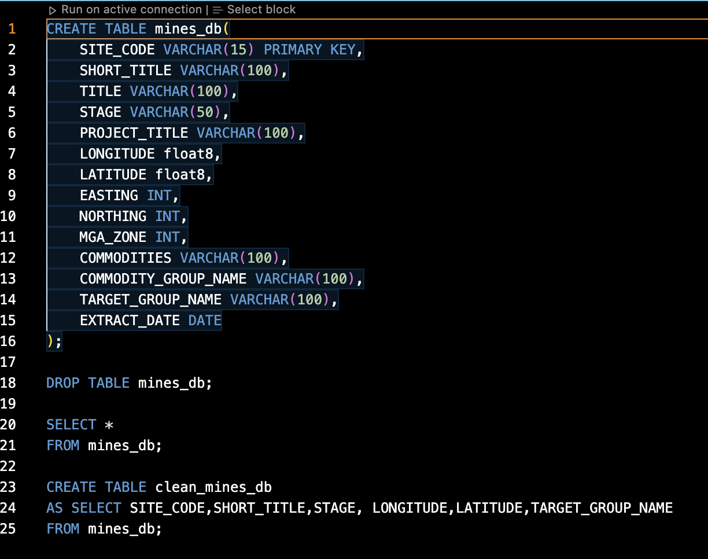
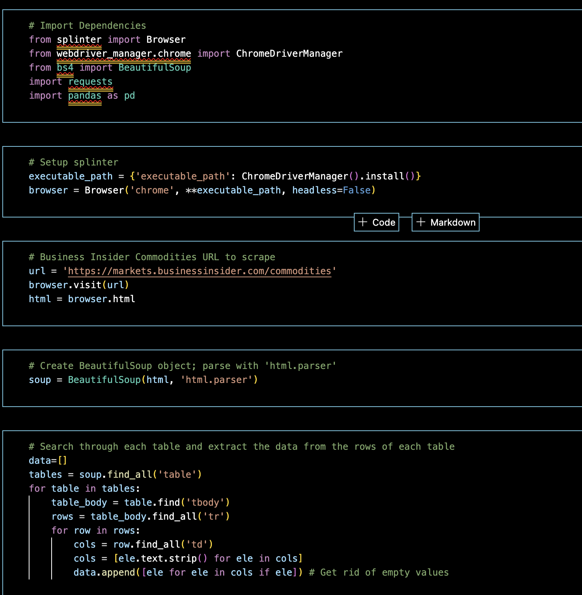
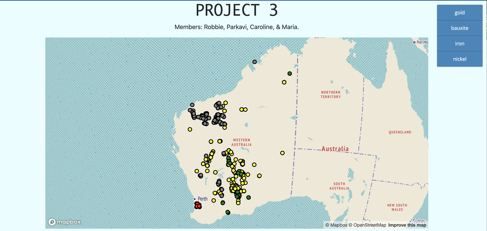

# PROJECT 3

**Group members: Caroline, Parkavi, Maria, Robbie**

---

## Project Specialisation Brief

We are using Data from the Department of Mines, Industry Regulation and Safety that contains data on the mines within WA. As mines are a major focus of the WA economy we would like to use the data to show the commodities that have been mined in WA and the costs.

The dataset compiled all operating and in development mines in Western Australia. 4 of the top commodities were chosen to focus on. Those were gold, iron ore, nickel, and bauxite-alumina.

Our idea was to have a dashboard showing three separate visualisations. The main image is a map showing the locations of mines with popups describing the mine with name, commodity, and operational status. The second is a real time visualisation of commodity price.

---
1. [Selection of Dataset](#selection-of-dataset)
2. [Creation of Database](#creation-of-database)
3. [Web Scraping for Commodity Price](#web-scraping-for-commodity-price)
4. [Final Dashboard](#final-dashboard)
---
## 1. SELECTION OF DATASET

Sources:  
*  [Department of Mines, Industry Regulation, & Safety](https://dasc.dmirs.wa.gov.au/home?productAlias=MINEDEXOperatingMines) - MINDEX Operating Mines Map - (GDA1994) .CSV

[Back to top](#project-3)

---
## 2. CREATION OF DATABASE

[Back to top](#project-3)

---
## 3. WEB SCRAPING FOR COMMODITY PRICE

[Back to top](#project-3)

---
## 4. FINAL DASHBOARD AND PRESENTATION

The final dashboard has an interactive menu that allows the user to choose which comodity is shown on the map. Each marker has a popup that shows the mine sites short name, target commodity, and operational status.

The Javascript library used was [Mapbox GL JS](https://www.mapbox.com/) 

The presentation slides can be found [here](https://docs.google.com/presentation/d/1PPfKKndTFRHMGkfJ_Qz0hURKalBQIM8VvE-9795dGUo/edit#slide=id.p)

[Back to top](#project-3)

---
©2022